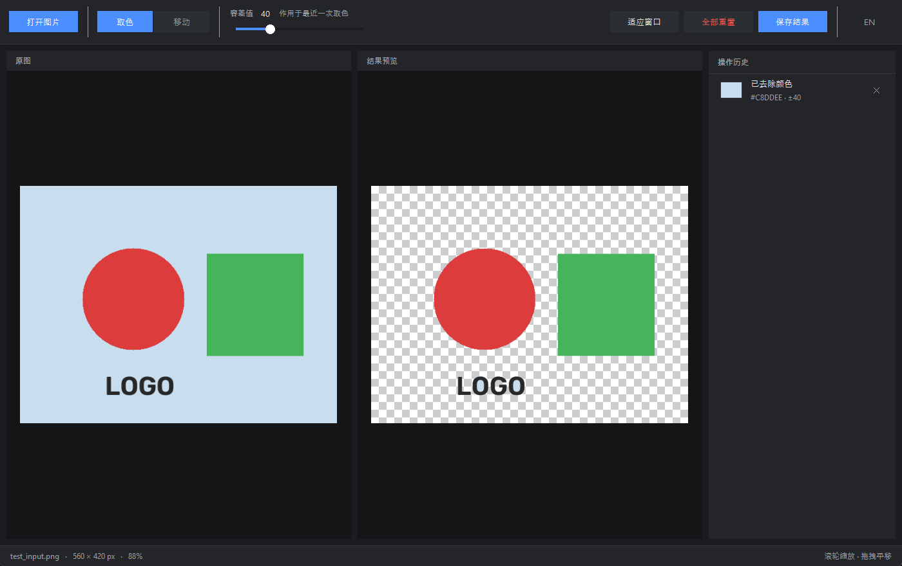

# MagicRemover

A desktop background remover that trades one-click AI for precise, offline control.

Most background removers are a black box: you get one shot, and when the model clips
an edge wrong there is no way to correct just that part — plus your image has to be
uploaded to someone else's server. MagicRemover takes the opposite approach. It uses
classic computer vision (flood-fill colour keying) instead of a model, so every
removal is something you aim, tune, stack, and undo yourself. Nothing leaves your
machine.

Best suited to images with flat, solid-colour backgrounds — logos, product shots,
screenshots, scanned artwork.



## Download

**[MagicRemover.exe](https://github.com/xzh1988g/Background_Removal/releases/latest/download/MagicRemover.exe)** — Windows 64-bit, self-contained, no Python needed.

The executable is not code-signed, so Windows SmartScreen will flag the publisher as
unknown; choose **More info → Run anyway**, or run from source as described below.

## Features

- **Click-to-remove colour keying** — click any colour in the image; flood fill selects
  the contiguous region within an adjustable tolerance and writes it to the alpha channel.
- **Non-destructive, editable history** — every pick is a separate layer in the history
  panel. Delete any one of them at any time; the result recomposites instantly.
- **Adjustable tolerance** — the slider retunes the most recent pick live, so you can
  dial in the edge without starting over.
- **Synced dual view** — the original and the transparency preview (rendered over a
  checkerboard) share one zoom/pan viewport, so you always compare the same region.
- **Pick / Move modes** — scroll to zoom toward the cursor, drag to pan. Only the
  on-screen region is ever scaled, so zooming stays fast on large images.
- **Export with resizing** — save as PNG at original size, or a custom size with
  optional aspect-ratio lock.
- **Bilingual UI** — switch between English and Chinese at runtime; no restart.
- **Unicode-safe file I/O** — uses `cv2.imdecode`/`imencode` so non-ASCII paths
  (e.g. Chinese filenames) work correctly on Windows.
- **Runs offline** — no network calls, no uploads, no account.

### Shortcuts

| Key | Action |
| --- | --- |
| `Ctrl` + `O` | Open image |
| `Ctrl` + `S` | Save result |
| `Ctrl` + `Z` | Undo the latest pick |

## Requirements

- Python 3.8+
- `opencv-python`, `numpy`, `Pillow`

`tkinter` ships with the standard library on Windows and macOS. On Debian/Ubuntu
install it separately: `sudo apt install python3-tk`.

## Install & run

```bash
git clone https://github.com/xzh1988g/Background_Removal.git
cd Background_Removal
pip install opencv-python numpy Pillow
python bg_remover.py
```

### Build a standalone .exe (Windows)

```bash
pip install pyinstaller
pyinstaller --onefile --windowed --name MagicRemover bg_remover.py
```

The result is a single self-contained `dist/MagicRemover.exe` (~70 MB — OpenCV and
NumPy are bundled) that runs on machines with no Python installed.

## Usage

1. **Open Image** — loads PNG / JPG / BMP / WEBP.
2. Stay in **Pick** mode and click the background colour you want gone.
3. Drag the **Tolerance** slider to tighten or loosen that pick until the edge looks right.
4. Click more colours to remove them too — each becomes its own entry in **History**.
   Click **✕** on any entry to take just that one back.
5. Switch to **Move** mode to drag the view; the scroll wheel zooms in either mode,
   and **Fit** returns to the whole image.
6. **Save Result** — choose original or custom export size, then save as PNG.
7. **Reset All** clears every pick and returns to the untouched image.

Use the **中文 / EN** button in the top-right corner to switch languages at any time —
your picks and zoom are preserved across the switch.

## How it works

The image is loaded as BGRA. Each click runs `cv2.floodFill` in `FLOODFILL_MASK_ONLY`
mode with `FLOODFILL_FIXED_RANGE`, meaning every pixel is compared against the seed
colour you clicked (not against its neighbour), within `±tolerance` on each channel.
That produces a binary mask, stored alongside its seed point and tolerance rather than
being applied immediately.

Because the masks are kept as a list, the final image is recomputed from scratch on
every change: start from a fully opaque alpha channel, zero it wherever any mask is
set, write it into a copy of the original. This is what makes the history genuinely
non-destructive — deleting a pick simply drops it from the list, and the original
pixel data is never modified.

## Known limitations

- **Flat backgrounds only.** Flood fill keys on colour similarity, so gradients,
  textures, and busy backgrounds will not separate cleanly. This is not a matting
  model — it cannot cut out hair or soft, semi-transparent edges.
- **Hard alpha edges.** The mask is binary with no feathering or anti-aliasing, which
  can leave visible stair-stepping on curves against a contrasting new background.
- **The tolerance slider only affects the most recent pick.** Earlier picks keep the
  tolerance they were made with; to change one, delete it and pick again.
- **Export is PNG only** (which is the format that preserves transparency anyway).

## License

[MIT](LICENSE)

---

# MagicRemover（中文）

一个桌面去背工具：放弃一键 AI，换来精确、离线、可反悔的控制权。

大多数去背工具是个黑盒——只有一次机会，模型把边缘抠错了也没法只修那一处，而且必须
把图片上传到别人的服务器。MagicRemover 走的是相反的路：它用传统计算机视觉（漫水填充
颜色键控）而不是模型，每一次去除都由你自己瞄准、微调、叠加和撤销，且全程不联网。

最适合纯色背景的图片——logo、商品图、截图、扫描稿。

## 下载

**[MagicRemover.exe](https://github.com/xzh1988g/Background_Removal/releases/latest/download/MagicRemover.exe)** — Windows 64 位，单文件自包含，无需安装 Python。

由于没有做代码签名，Windows SmartScreen 会提示"未知发布者"，点 **更多信息 → 仍要运行**
即可；也可以按下文说明从源码运行。

## 功能

- **点击即去除的颜色键控** — 点击图中任意颜色，漫水填充按可调容差选出相连区域并写入
  alpha 通道。
- **非破坏性的可编辑历史** — 每次取色都是历史面板中独立的一层，随时可以删掉其中任意
  一条，结果立即重新合成。
- **可调容差** — 滑块会实时重算最近一次取色，不必推倒重来就能调好边缘。
- **双视图同步** — 原图与透明预览（棋盘格背景）共用同一套缩放/平移视图，永远在对比
  同一块区域。
- **取色 / 移动 双模式** — 滚轮以光标为中心缩放，拖拽平移。只有屏幕上可见的区域会被
  缩放绘制，因此再大的图放到多少倍都不卡。
- **导出可缩放** — 保存为 PNG，可选原始尺寸或自定义尺寸（支持锁定长宽比）。
- **双语界面** — 中英文可随时切换，无需重启。
- **中文路径安全** — 使用 `cv2.imdecode`/`imencode` 读写，Windows 下中文文件名可正常读写。
- **完全离线** — 不联网、不上传、不需要账号。

### 快捷键

| 按键 | 功能 |
| --- | --- |
| `Ctrl` + `O` | 打开图片 |
| `Ctrl` + `S` | 保存结果 |
| `Ctrl` + `Z` | 撤销最近一次取色 |

## 环境要求

- Python 3.8+
- `opencv-python`、`numpy`、`Pillow`

Windows 和 macOS 自带 `tkinter`。Debian/Ubuntu 需单独安装：`sudo apt install python3-tk`。

## 安装与运行

```bash
git clone https://github.com/xzh1988g/Background_Removal.git
cd Background_Removal
pip install opencv-python numpy Pillow
python bg_remover.py
```

### 打包成独立 exe（Windows）

```bash
pip install pyinstaller
pyinstaller --onefile --windowed --name MagicRemover bg_remover.py
```

产物是单个自包含的 `dist/MagicRemover.exe`（约 70 MB，因为打包了 OpenCV 和 NumPy），
在没装 Python 的电脑上双击即可运行。

## 使用方法

1. **打开图片** — 支持 PNG / JPG / BMP / WEBP。
2. 保持在 **取色** 模式，点击你想去掉的背景颜色。
3. 拖动 **容差值** 滑块收紧或放宽这次取色，直到边缘合适。
4. 继续点击其他颜色一并去除——每次都会成为 **操作历史** 里的一条。点某条的 **✕**
   即可只撤销那一次。
5. 切到 **移动** 模式拖动画面；两种模式下滚轮都能缩放，**适应窗口** 可回到全图。
6. **保存结果** — 选择原始或自定义导出尺寸，保存为 PNG。
7. **全部重置** 清空所有操作，回到未处理的原图。

右上角的 **EN / 中文** 按钮可随时切换语言，已有的操作历史和缩放状态都会保留。

## 实现原理

图片以 BGRA 格式载入。每次点击调用 `cv2.floodFill`，使用 `FLOODFILL_MASK_ONLY` 加
`FLOODFILL_FIXED_RANGE`——即每个像素都与你点击的种子颜色比较（而非与相邻像素比较），
各通道容差为 `±tolerance`。这会产生一张二值掩码，它与种子点、容差一起被存起来，而不是
立刻应用到图上。

因为掩码是以列表形式保存的，最终图像在每次变动时都从头重算：从完全不透明的 alpha
通道开始，把任意掩码覆盖到的位置置零，再写入原图的副本。这正是历史记录真正"非破坏性"
的原因——删除一次取色只是把它从列表里移除，原始像素数据从未被修改过。

## 已知限制

- **仅适用于纯色背景。** 漫水填充依据颜色相似度工作，因此渐变、纹理和复杂背景无法干净
  分离。它不是抠图模型，做不了头发丝和半透明的柔和边缘。
- **alpha 边缘是硬的。** 掩码是二值的，没有羽化或抗锯齿，换到反差大的新背景上时曲线
  边缘可能有可见的锯齿。
- **容差滑块只影响最近一次取色。** 更早的操作保持它们当时的容差；要改就删掉重新取色。
- **只能导出 PNG**（本来也只有 PNG 能保留透明度）。

## 许可证

[MIT](LICENSE)
